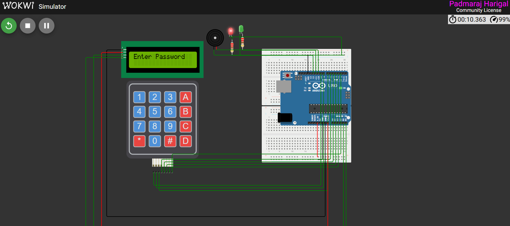
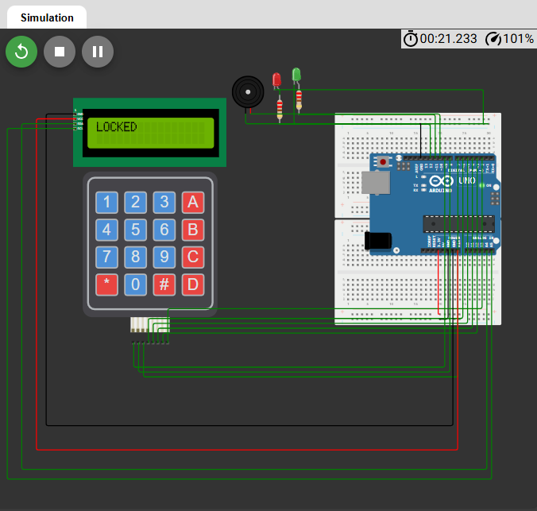

# Digital Safe Locker System

## Objective
To design and simulate a **password-based digital locker** using Arduino that allows limited access attempts and permanently locks after repeated failures.

---

## System Description
This project implements a **secure digital locker** using an Arduino UNO, a 4×4 membrane keypad for password entry, an I2C LCD for user feedback, LEDs for status indication, and a buzzer for alerts.

---

## Key Features
- Default password: **1A77**
- Password entry using **4×4 keypad**
- Masked input display on **16×2 LCD**
- **Green LED** indicates correct password
- **Red LED + buzzer** indicate wrong password
- Maximum **3 attempts allowed**
- **Permanent lock** after 3 incorrect attempts

---

## Working Principle
1. User enters a 4-character password using the keypad  
2. Input is masked on the LCD  
3. Entered password is compared with the stored password  
4. System response:
   - **Correct password**
     - LCD displays `OPEN`
     - Green LED turns ON
     - Buzzer beeps once
   - **Wrong password**
     - LCD displays `WRONG 1 / WRONG 2 / WRONG 3`
     - Red LED blinks
     - Buzzer sounds continuously
   - **After 3 wrong attempts**
     - LCD displays `LOCKED`
     - System blocks all further input

---

## Simulation
**Wokwi Web Simulation:**  
https://wokwi.com/projects/455387114618411009

---

## Simulation Results

### 1. Setup Interface
Complete circuit setup in Wokwi.

### 2. Access Granted
Correct password entered – system unlocked.

### 3. Locked State
System locked after three incorrect attempts.

---

## Conclusion
The digital safe locker system demonstrates password authentication, attempt limitation, and secure lockout using embedded system components.

---

## Author
**Rohan Rathod**  
